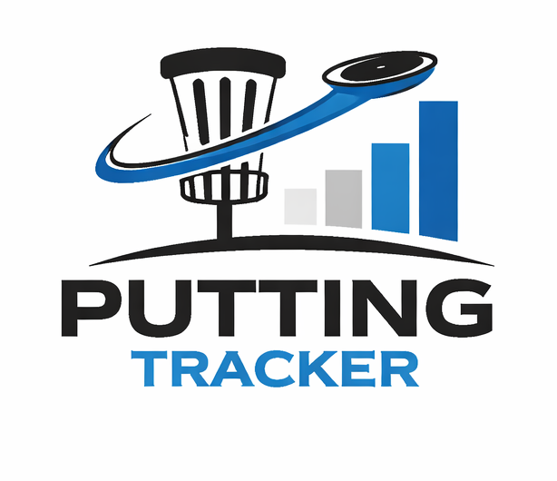
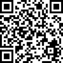

# Putting Tracker

## About Putting Tracker

This tool helps you track your putting accuracy across different distances.

Please share it with your fellow discgolfers! We are working on new features and improvements.

## Feedback and Suggestions

If you have any feedback or suggestions, feel free to reach out via:

- [GitHub Issues](https://github.com/F9k-27/Putting_tracker/issues)
- [Contact form](https://docs.google.com/forms/d/e/1FAIpQLSfF94MN6A2Km8bQsYO5lbPzx5nf2Z0mYJU_t2NX1kvaHa0VEQ/viewform?usp=publish-editor)

## Support the Project

Like this project?

Support future development via [PayPal](https://www.paypal.com/donate/?hosted_button_id=ULEZTSWZFVPSG).

## Things We Want to Achieve in future

We are actively working on expanding the Putting Tracker with new features to make it more useful for players of all levels.

Planned improvements include:

- 👤 User accounts with login functionality
- 💾 Saving and managing personal data directly inside the app
- 🏆 Putting leagues for existing discgolf courses
- 📊 Advanced statistics and performance tracking
- 📱 Improved usability and mobile experience
