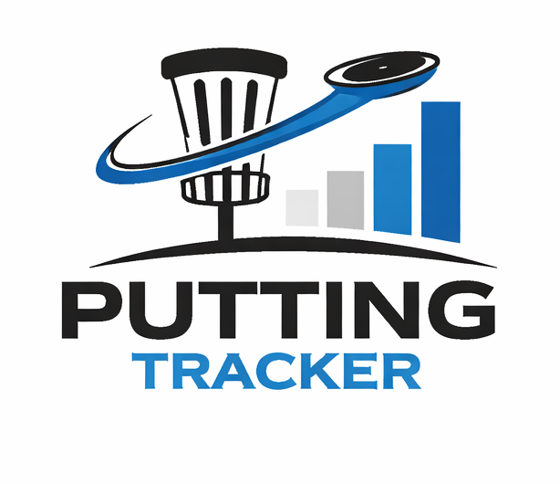
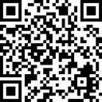

# Putting Tracker

## About Putting Tracker

This tool helps you track your putting accuracy across different distances.

Please share it with your fellow discgolfers! We are working on new features and improvements.
[Link](https://f9k-27.github.io/Putting_tracker/) to the application.

## Features

- **Distance tracking** — Pick any distance from 1–35 m (3–115 ft) with the slider or arrow buttons, choose how many discs are in your bag, log your misses, and press **OK** to record your success rate for that distance. Meters/feet toggle in the top-right.
- **Stance selector** — Tap the **🧍 Stance** toggle to reveal a picker for Staggered, Straddle, Kneeling, Turbo, Split, and Lunge putts. **Jump putt** unlocks only when the distance is greater than 10 m.
- **Accuracy practice (🎯)** — Arm the crosshair button next to the game button, then after pressing **OK** a pop-up basket appears where you tap to mark where each disc landed (one tap per disc). Landing marks are stored per distance for the current session.
- **Game mode (🎮)** — The distance changes randomly every throw. Set the min/max distance and total throws, hit **Sink** or **Miss** for each, and see your final score and success rate. Optionally have the **stance change randomly** each throw. The accuracy toggle is hidden while a game is running.
- **End Practice summary** — Click **End Practice** for a session overview: total putts, makes/misses, overall success rate, distances practiced, sessions, and your best & toughest distances.
- **Landing heatmaps** — If you recorded accuracy marks, the summary shows a heatmap of where your discs landed (with your average spot per distance), plus a **per-distance** view with individual heatmaps, a consistency score, and horizontal/vertical grouping bias.
- **Import / export** — Download your stats as JSON or upload a previous session. (Accuracy heatmap marks are session-only and are not part of the export.)

## Documentation

- [index.html](docs/index.html.md) — HTML structure, element IDs, assets
- [style.css](docs/style.css.md) — CSS variables, selectors, media queries
- [script.js](docs/script.js.md) — Functions, state variables, event listeners

## Feedback and Suggestions

If you have any feedback or suggestions, feel free to reach out via:

- [GitHub Issues](https://github.com/F9k-27/Putting_tracker/issues)
- [Contact form](https://docs.google.com/forms/d/e/1FAIpQLSfF94MN6A2Km8bQsYO5lbPzx5nf2Z0mYJU_t2NX1kvaHa0VEQ/viewform?usp=publish-editor)

## Support the Project

Like this project?

Support future development via [PayPal](https://www.paypal.com/donate/?hosted_button_id=ULEZTSWZFVPSG).

## Things We Want to Achieve in future

We are actively working on expanding the Putting Tracker with new features to make it more useful for players of all levels.

Planned improvements include:

- 🌐 Buy domain for easier search
- 👤 User accounts with login functionality
- 💾 Saving and managing personal data directly inside the app
- 🏆 Putting leagues for existing discgolf courses
- 📊 Advanced statistics and performance tracking
- 📱 Improved usability and mobile experience
